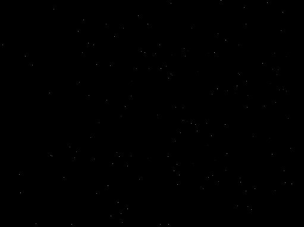



## twist on the old starfield

### Description

As well as showing the basics behind 3d conversion, it looks cool ;) I've commented EVERY line and principle so you WILL know what's happening. The twist is a cool moving "camera" effect that I made bounce around. Looks quite cool.
 
### More Info
 
Clicking the screen stops the stars, hitting a key ends the program.

             |
---                |---
**Submitted On**   |2002-05-23 20:26:24
**By**             |[Bryn Davies](https://github.com/Planet-Source-Code/PSCIndex/blob/master/ByAuthor/bryn-davies.md)
**Level**          |Intermediate
**User Rating**    |4.8 (24 globes from 5 users)
**Compatibility**  |VB 6\.0
**Category**       |[Graphics](https://github.com/Planet-Source-Code/PSCIndex/blob/master/ByCategory/graphics__1-46.md)
**World**          |[Visual Basic](https://github.com/Planet-Source-Code/PSCIndex/blob/master/ByWorld/visual-basic.md)
**Archive File**   |[twist\_on\_t863305232002\.zip](https://github.com/Planet-Source-Code/bryn-davies-twist-on-the-old-starfield__1-35042/archive/master.zip)

### API Declarations

None needed.

